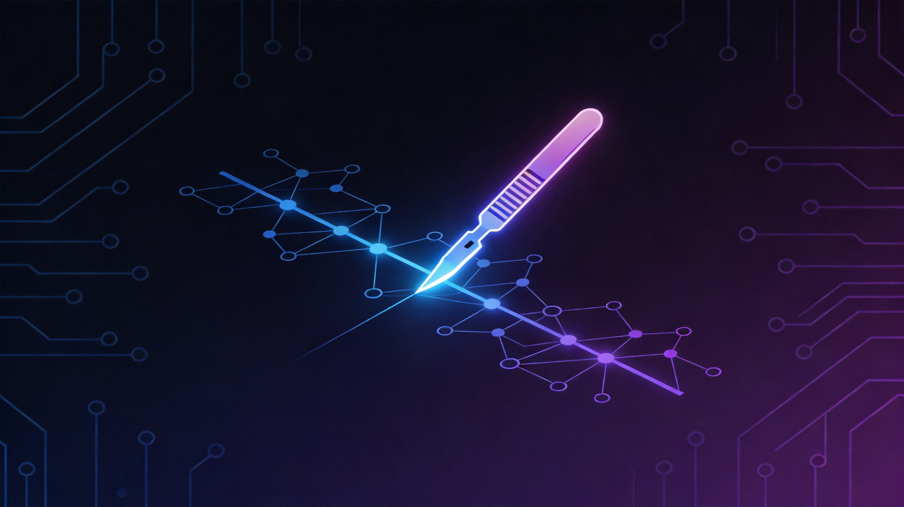
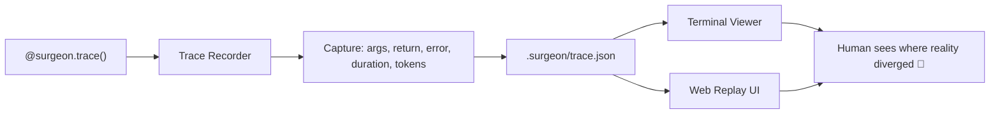

<p align="center">
  
</p>

<h1 align="center">🔬 Agent-Surgeon</h1>

<p align="center">
  <strong>Time-travel debugging for your LLM agents.</strong><br/>
  Stop staring at logs like a caveperson. Rewind the whole agent run.
</p>

<p align="center">
  <a href="https://pypi.org/project/agent-surgeon/"></a>
  <a href="https://pypi.org/project/agent-surgeon/"></a>
  <a href="LICENSE"></a>
  <a href="https://github.com/anthropic-agents/agent-surgeon/stargazers"></a>
</p>

<p align="center">
  <a href="#-quick-start">Quick Start</a> •
  <a href="#-features">Features</a> •
  <a href="#-framework-integrations">Integrations</a> •
  <a href="#-demo">Demo</a> •
  <a href="#-roadmap">Roadmap</a> •
  <a href="#-contributing">Contributing</a>
</p>

---

## 💡 The Problem

Agent apps fail in extremely *creative* ways:

- 🤯 The planner hallucinated a step
- 🧩 The tool returned weird context
- 🔁 The retry made things worse
- 🕳️ The exception got swallowed three frames deep
- 😎 The final answer looked confident anyway™

Traditional logs tell you **something** happened. Agent-Surgeon shows you **the whole timeline**.

---

## ⚡ Quick Start

```bash
pip install agent-surgeon
```

Instrument your agent with **one line**:

```python
from surgeon import surgeon, patch_openai_client
from openai import OpenAI

# Trace any function
@surgeon.trace()
def my_agent_step(query: str) -> str:
    ...

# Or patch an OpenAI client directly
client = patch_openai_client(OpenAI())
```

Run and replay:

```bash
python your_agent.py
surgeon-view          # Terminal timeline
surgeon-web --open    # Glossy HTML replay
```

That's it. No config files. No dashboard servers. No 47-step setup.

---

## ✨ Features

| Feature | Description |
|---------|-------------|
| 🎯 **One-decorator tracing** | `@surgeon.trace()` captures args, returns, errors, duration |
| 🌳 **Nested timeline** | Parent-child relationships auto-detected via context |
| 💰 **Token & cost tracking** | Estimated usage and USD cost per LLM call |
| 🔄 **Input/output diffs** | See what changed between prompt and completion |
| 🛡️ **Loop guard** | Detects and intercepts infinite thought loops |
| 🌊 **Streaming support** | Traces OpenAI SDK `stream=True` chunks in real-time |
| 🖥️ **Terminal replay** | Screenshot-ready `rich` timeline in your terminal |
| 🌐 **Web replay** | Glassmorphism HTML report at `.surgeon/report.html` |
| 📦 **Zero config** | Just a decorator. Local JSON trace. No infra needed |

---

## 🔌 Framework Integrations

Native hooks for the most popular agent stacks — no wrapper gymnastics:

<table>
<tr>
<td width="33%" valign="top">

### OpenAI SDK

```python
from openai import OpenAI
from surgeon import patch_openai_client

client = patch_openai_client(OpenAI())
# All calls now traced automatically
# Including streaming!
```

</td>
<td width="33%" valign="top">

### LangChain

```python
from surgeon import LangChainTraceHandler

handler = LangChainTraceHandler()
chain.invoke(
    {"input": "..."},
    config={"callbacks": [handler]}
)
```

</td>
<td width="33%" valign="top">

### AutoGen

```python
from surgeon import AutoGenTraceBridge

bridge = AutoGenTraceBridge()
conv = bridge.on_conversation_start(
    "planner", task
)
# Messages & tools auto-tracked
```

</td>
</tr>
</table>

---

## 🎬 Demo

<p align="center">
  
</p>

<details>
<summary>📟 Terminal output preview</summary>

```text
🔬 Agent Surgeon Timeline
└── agent_run · 451.21ms
    ├── bootstrap:web_replay · 0.01ms
    ├── analyze_task · 80.12ms
    ├── plan_steps · 120.90ms
    ├── call_tool
    │   └── fake_search_tool · 95.44ms
    ├── call_tool
    │   └── fake_calculator_tool · 42.88ms
    ├── call_tool
    │   └── fake_db_lookup_tool · ERROR 💥 · 17.02ms
    ├── recover_from_error · 30.15ms
    ├── simulate_loop_guard · LOOP DETECTED 🛡️
    ├── langchain:growth_research_chain · 112.33ms
    ├── openai:chat.completions (stream) · 89.22ms
    ├── autogen:planner+critic duo · 65.10ms
    └── synthesis:final_answer · 60.04ms
```

</details>

Run the full demo yourself:

```bash
git clone https://github.com/anthropic-agents/agent-surgeon.git
cd agent-surgeon
pip install -e .
python example.py
surgeon-web --open
```

---

## 🏗️ How It Works



### Execution model

1. `@surgeon.trace()` wraps a function call
2. Each invocation gets a trace node with a unique ID
3. Nested calls inherit parent-child relationships via `contextvars`
4. Result, exception, token usage, and cost are serialized to local storage
5. The viewer reconstructs the timeline as an interactive tree

---

## 📁 Project Structure

```text
agent-surgeon/
├── src/surgeon/
│   ├── __init__.py      # Public API exports
│   ├── tracer.py        # Core trace recorder & span handling
│   ├── hooks.py         # Framework integrations (OpenAI, LangChain, AutoGen)
│   ├── insights.py      # Token estimation, cost calc, loop guard
│   ├── storage.py       # Local JSON trace store
│   ├── viewer.py        # Rich terminal timeline
│   └── web.py           # HTML report generator
├── example.py           # Full demo with all integrations
├── pyproject.toml       # Package configuration
└── docs/
    └── demo.gif         # Demo recording
```

---

## 🗺️ Roadmap

- [x] Function-level tracing with `@surgeon.trace()`
- [x] Nested parent-child timeline
- [x] OpenAI SDK patching (including streaming)
- [x] LangChain callback handler
- [x] AutoGen conversation bridge
- [x] Token usage & cost estimation
- [x] Loop guard detection
- [x] Terminal replay (`surgeon-view`)
- [x] Web replay (`surgeon-web`)
- [ ] **Async/await tracing**
- [ ] **Trace diffing** — compare two runs side-by-side
- [ ] **OpenTelemetry export** — plug into your existing observability stack
- [ ] **CrewAI / LlamaIndex adapters**
- [ ] **VS Code extension** — trace viewer in your editor
- [ ] **PyPI release** — `pip install agent-surgeon`
- [ ] **Hosted replay** — share trace links with your team

---

## 🤝 Contributing

We'd love your help! Check out [CONTRIBUTING.md](CONTRIBUTING.md) to get started.

Whether it's a bug report, feature request, new framework adapter, or documentation improvement — all contributions are welcome.

---

## 📜 License

[MIT](LICENSE) — use it however you want.

---

<p align="center">
  <sub>Built with ❤️ for agent developers who are tired of <code>print("here 3")</code></sub>
</p>
