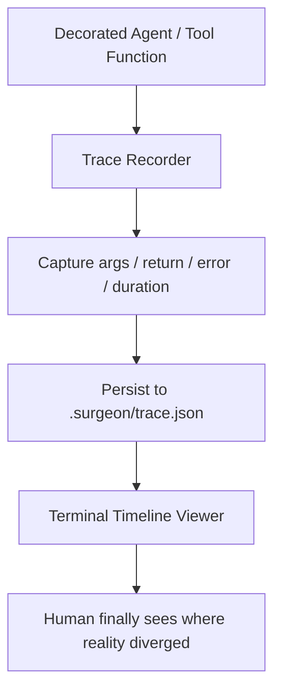

# Agent-Surgeon

> **Time-travel debugging for your LLM agents.**
>
> Stop staring at logs like a caveperson. Rewind the whole agent run.

Agent-Surgeon is an open-source MVP for AI agent developers who want to see **what happened, in what order, with what inputs, with what outputs, and where the chaos began**.

With one tiny decorator, you get a local execution trace, nested call timeline, exceptions, latency, and a replayable terminal view that is screenshot-ready for demos, tweets, and late-night "aha" moments.

---

## Why this exists

Agent apps fail in extremely *creative* ways:

- the planner hallucinated a step
- the tool returned weird context
- the retry made things worse
- the exception got swallowed three frames deep
- the final answer looked confident anyway™

Traditional logs tell you **something** happened.
Agent-Surgeon shows you **the whole timeline**.

---

## The pitch

**Instrument your agent like this:**

```python
from surgeon import surgeon

@surgeon.trace()
def call_tool(name, payload):
    ...
```

**Then replay it like this:**

```bash
python example.py
surgeon-view
```

And boom: you get a nested timeline with

- function inputs
- return values
- duration
- parent/child relationships
- captured exceptions
- persistent local trace data in `.surgeon/trace.json`

---

## Quick Start

```bash
python3 -m venv .venv
source .venv/bin/activate
pip install -e .
python example.py
surgeon-view
```

If you want a fresh run:

```bash
rm -rf .surgeon
python example.py
```

---

## What the MVP includes

- `@surgeon.trace` decorator for function-level tracing
- local JSON trace store at `.surgeon/trace.json`
- screenshot-friendly terminal timeline powered by `rich`
- a dummy agent demo with fake tools and a controlled failure
- a README dramatic enough to deserve a GIF

---

## How it works



### Execution model

1. `@surgeon.trace()` wraps a function call
2. each invocation gets a trace node
3. nested calls inherit parent-child relationships
4. result or exception is serialized to local storage
5. the viewer reconstructs the timeline as a tree

---

## Demo flow

The included `example.py` simulates an agent that:

1. analyzes a task
2. calls a planner
3. invokes multiple fake tools
4. hits one intentional failure
5. recovers and still produces a final answer

That means the timeline is actually interesting, not just a toy hello-world trace.

---

## Terminal UI preview

```text
Agent Surgeon Timeline
└── agent_run · 451.21ms
    ├── analyze_task · 80.12ms
    ├── plan_steps · 120.90ms
    ├── call_tool[search] · 95.44ms
    ├── call_tool[calculator] · 42.88ms
    └── call_tool[db_lookup] · ERROR · 17.02ms
```

It is intentionally optimized for terminal screenshots. No dashboard yak-shaving required.

---

## GIF demo placeholder

> Put your launch-day terminal replay GIF here and farm the quote tweets.

```md

```

---

## Project structure

```text
Agent-Surgeon/
├── README.md
├── example.py
├── pyproject.toml
└── src/
    └── surgeon/
        ├── __init__.py
        ├── storage.py
        ├── tracer.py
        └── viewer.py
```

---

## MVP philosophy

This repo is intentionally tiny. The goal is not enterprise telemetry.
The goal is to make agent debugging feel like:

> "Wait... I can actually see the mistake now."

Future directions:

- async tracing
- token / prompt capture
- tool invocation adapters for common agent frameworks
- local web replay UI
- trace diffing across runs
- OpenTelemetry export

---

## Why the name?

Because sometimes your agent is alive, but only technically.

---

## License

MIT

---

## New in v0.2

### Screenshot-grade local Web UI

Agent-Surgeon now exports a glossy local HTML replay at .surgeon/report.html.

Run:

    python example.py
    surgeon-web --open

You get:

- a bold hero section for demos and screenshots
- searchable timeline cards
- framework filters
- a structured event inspector for args, metadata, outputs, and errors

### Native-style hooks for popular Agent stacks

Out of the box, the MVP now includes lightweight adapters for:

- LangChain-style callback handlers
- OpenAI Agents-style lifecycle hooks
- AutoGen-style conversation and tool tracing

Import them like this:

    from surgeon import LangChainTraceHandler, OpenAIAgentsTracer, AutoGenTraceBridge

The included example.py simulates all three, so one run now produces a much richer trace for social-ready screenshots.

---

## New in v0.3

### Developer painkillers

Agent-Surgeon now surfaces the stuff that actually hurts when shipping Agent systems:

- estimated token usage per LLM span
- estimated cost per model call
- input vs output diff previews for LLM hops
- loop guard interception for repeated identical thoughts
- richer terminal and web replay views for fast debugging

### Run the full demo

```bash
python example.py
surgeon-view
surgeon-web --open
```

The demo now includes:

- classic decorator tracing
- LangChain style callback tracing
- OpenAI Agents style lifecycle tracing
- AutoGen style conversation tracing
- a deliberate loop guard tripwire
- token and cost annotations in the replay UI

---

## New in v0.4

### Real framework interception

The MVP now goes beyond simulated callbacks:

- `LangChainTraceHandler` plugs into real LangChain callback flow
- `patch_openai_client(...)` monkey-patches a real OpenAI Python SDK client
- the demo uses `httpx.MockTransport`, so the OpenAI SDK path runs end-to-end **without** a real API key or network dependency

### Why this matters

This means Agent-Surgeon can now trace *actual framework traffic*, not just toy wrappers:

- real callback lifecycles
- real request / response payload interception
- real token / cost annotation on SDK-shaped responses
- real diff previews between model input and output

